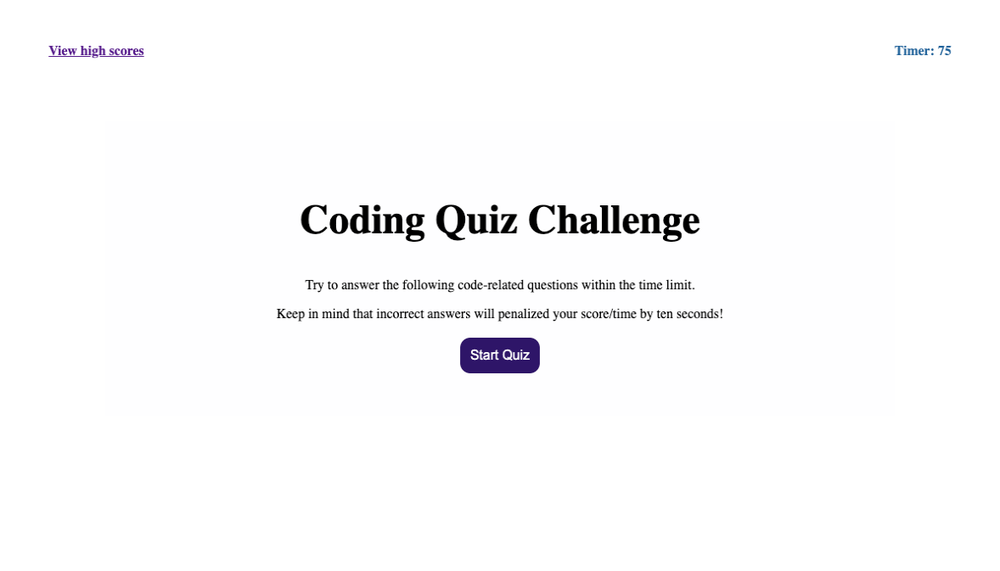
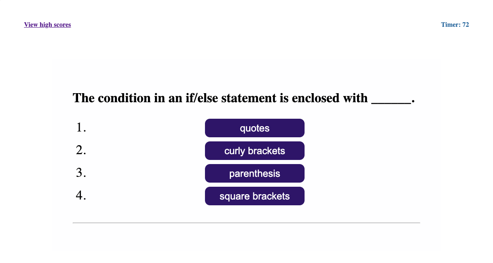
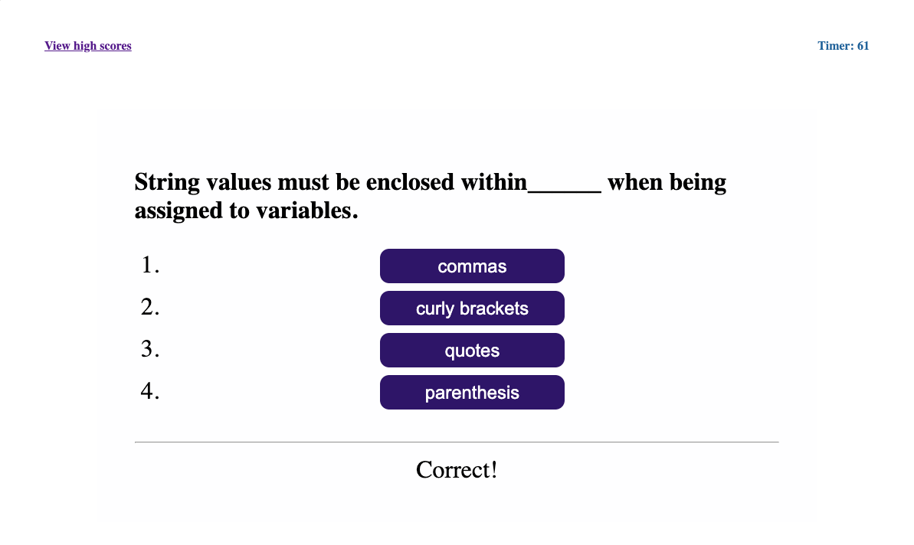
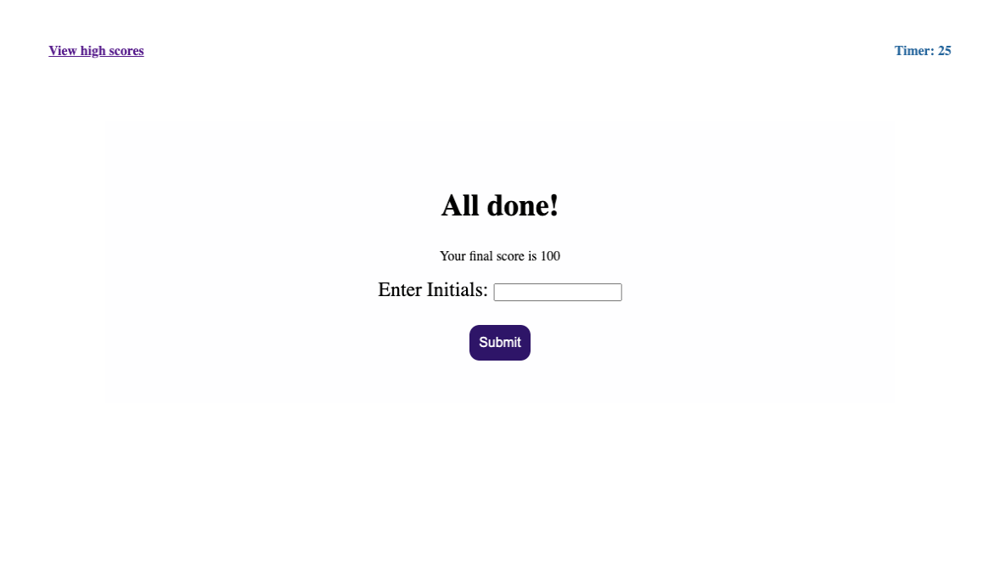
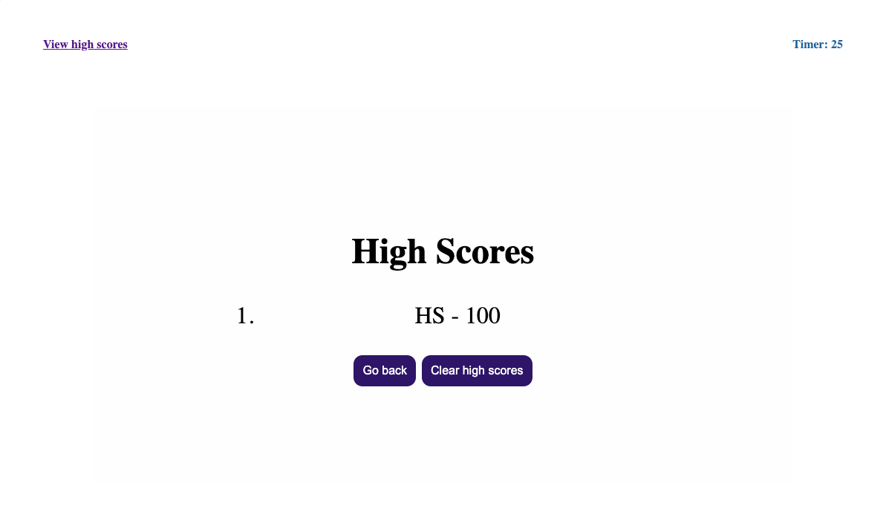

# Code-Quiz
An app will run in rowser, and will feature dynamically updated HTML and CSS powered by JavaScript code.

## Code style
HTML
CSS
JAVA SCRIPT

# Built with
The user arrives at the landing page and is presented with a call-to-action to "Start Quiz." 
Also note the navigation option to "View high scores" and the "Timer".

Clicking the "Start Quiz" button presents the user with a multiple-choice questions（total of 5 questions）. 
The timer is initialized with a value and immediately begins countdown.

Answering incorrectly results in a time penalty (10 seconds are subtracted from time remaining).
user will gain 25 score if a question was answered correct.

When time runs out and/or all questions are answered, the user is presented with their final score and asked to enter their initials. 
Their final score and initials are then stored in localStorage. 
Check "View high scores" will display a user initials and scores list.
Go back would restart the quiz, clear score will delete all the user's information.

## Screenshots

# Link to Webpage
[Code-Quiz](https://neeko623.github.io/Code-Quiz/)